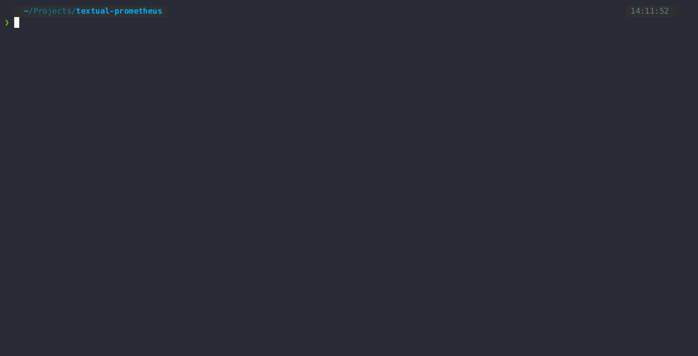

# [WIP] textual-prometheus

Simple tool to query prometheus/thanos API and plot it in the terminal

## Features

- Simple configuration
- All fields use textual-autocomplete
- Instance and metric fields are dynamic and based on what's available on the api
- Simple history of previous graphs
- As long as there are not too many outputs, supports promql regex syntax
  for both instance and metric fields 

## Limitations

- Timeframe is currently hardcoded to last 24h
- Will currently auto-update once every 60s only

## Installation

Since this package is still in development and not ready for release,
the simplest way to install it is with pipx

```console
$ pipx install git+https://github.com/UmBsublime/textual-prometheus.git
```

## Configuration

You can find an example configuration [here](./config.toml.example). 
Simply rename the file to config.toml and edit the values.

## Usage



Once installed with pipx you will have the `tprom` cli added to `~/.local/bin/`.

Currently, the tool needs the configuration file to be in your local directory

## TODO

Non-exhaustive list of features I might implement one day.

- Add default path for configuration
- Date picker for the query
- Ensure fields are generated in a thread (non-blocking)
- Ability to write the graph to a file
- Allow for the refresh-rate to be configurable